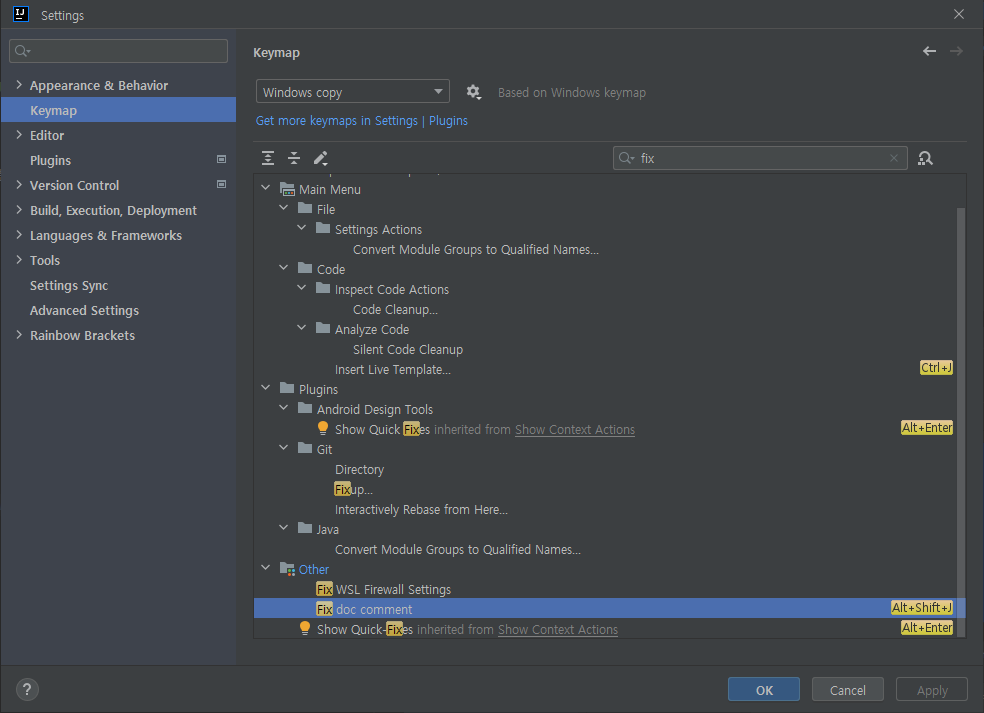

# IntelliJ Setting

## Basic
1. Build 및 Run `Gradle` -> `IntelliJ IDEA` 변경

2. Java 본인 버전으로 설정 및 Javac Options 에 `-parameters` 추가

3. Enable annotation processing 체크

4. `Project` 탭 우클릭 -> `Tree Appearance` -> `Compact Middle Packages` 체크 해제 

## Application
1. `Current Files...`(없음) 또는 `Application` 버튼 클릭 -> `Edit Configurations...` 클릭

2. 이미지 참조하여 적용 -> `-Dfile.encoding=UTF-8`

3. 추가 옵션 적용 -> `Modify options` -> `Add VM options`, `Exclude classes and packages`

4. VM options 적용

<pre>
-Xmx2027m
-Dfile.encoding=UTF-8
-Dconsole.encoding=UTF-8
-Duser.name=SangHoon
</pre>

## JavaDoc
1. JavaDoc 플러그인 설치

2. 파일 최상단으로 Header 적용 -> `Class`, `Interface`, `Enum`, `Record`, `AnnotationType`

3. File Header.java 작성

4. #foreach($param in $PARAMS) 부분 덮어쓰기(하단은 동일) -> `JavaDoc Method`, `JavaDoc Overriding Method`
<pre>
&lt;pre>
 * description
 * @method       : ${ELEMENT_NAME}
 * @author       : ${USER}
 * @date         : ${DATE} ${TIME}
&lt;/pre>
#if($PARAMS.size() > 0)
  * @param
  #foreach($param in $PARAMS)
    $param
  #end
#end
</pre>
 
5. fix 검색 후 단축키 설정 -> `fix doc comment`
 
6. 사용 예시 -> 파일 생성 시 자동 생성
 
7. 사용 예시2 -> method 클릭 후 단축키 입력

## Encoding -> 모두 `UTF-8` 설정

## Git 재연결(삭제 후 재로그인) -> `token` 필수

## Project Git 삭제 -> 실제 폴더에서도 `.git` 폴더(숨김) 삭제

---
# 🖥️ Tip

## 조회/검색하지 않을 폴더 Exclude 설정
1. 폴더 우클릭 -> `Mark Directory as` -> `Excluded`

2. Project 우측 ...(Options) 클릭 -> `Appearance` -> `Excluded Files` 체크 해제

## 주석 최신화(업데이트)

1. 단축키 입력 -> 정규식(Regex) 클릭
   - `검색(현재)` ctrl + f
   - `검색(전체)` ctrl + shift + f
   - `변경(현재)` ctrl + r
   - `변경(전체)` ctrl + shift + r
2. `주석` package 최신화
   - `찾을 내용(Search)` (?s)(/\*\*(?:.*?\R)*?\s*\*\s*packageName\s*:\s*)(.+?)(\R(?:.*?\R)*?^package\s+)([\w\.]+)(;)
   - `바꿀 내용(Replace)` $1$4$3$4$5

3. `주석` 날짜(date) 최신화
   - `찾을 내용(Search)` (^\s*\*\s*date\s*:\s*)\d{4}-\d{2}-\d{2}
   - `바꿀 내용(Replace)` $1`현재 날짜`
     - `예제` `$12025-05-16