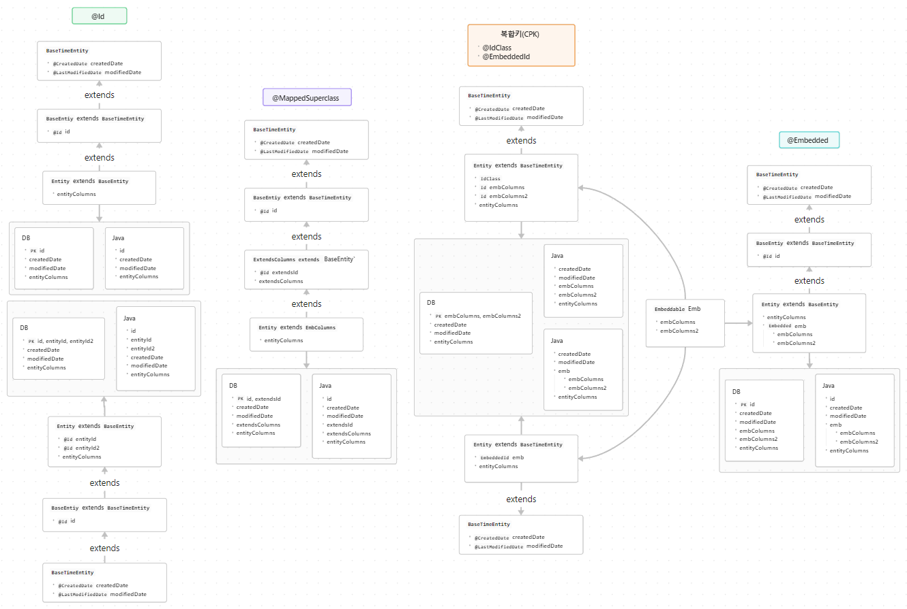

# SpringBoot-SideProject-JavaPersistenceAPI
스프링 부트 JPA

## 기본 구조


- **기본**
1. `PK` 단일 고유 ID 고정 -> 복합키 및 임의 ID 미사용
    - 단순/직관적이고, ORM(Hibernate) 에서 JPA 구현체의 단일키 방식이 권장되기에 호환성이 가장 높음
2. `BaseEntity` 모든 Entity 에 id, createdBy, modifiedBy, createdDate, modifiedDate, deleteYn 추가
3. `SoftDelete` 직접 delete 대신 deleteYn 으로 삭제 여부 처리
   - `Converter` deleteYn = true/false -> Y/N
   - cascade(ALL), orphanRemoval

```java
@Getter
@Entity
@NoArgsConstructor(access = AccessLevel.PROTECTED)
public class Entity extends BaseEntity {
    private String column1;
    private String column2;
}
```
```java
@Getter
@MappedSuperclass
@EntityListeners(AuditingEntityListener.class)
public abstract class BaseEntity {
    @Id
    @GeneratedValue(strategy = GenerationType.IDENTITY)
    private Long id;
    
    @CreatedBy
    protected String createdBy;

    @LastModifiedBy
    protected String modifiedBy;
    
    @CreatedDate
    protected LocalDateTime createdDate;

    @LastModifiedDate
    protected LocalDateTime modifiedDate;

    @ColumnDefault("'N'")
    @Convert(converter = BooleanToYnConverter.class)
    protected boolean deleteYn = false;
}
```
> { "createdDate" : "2025-04-22", "modifiedDate" : null, "deleteYn" : "N", "createdBy" : "UUID", "modifiedBy" : null, "id" : 1
> , "column1" : null, "column2" : null }

- **추가**
1. 공통적인 부분 모듈화 가능
   - @Embedded 방식이 권장됨

```java
@Getter
@Entity
@NoArgsConstructor(access = AccessLevel.PROTECTED)
public class Entity extends ExtendsEntity {
    private String column1;
    private String column2;
    @Embedded
    private EmbEntity embEntity = new EmbEntity();
}
```
```java
@Getter
@MappedSuperclass
public abstract class ExtendsEntity extends BaseEntity {
    private String column3;
}
```
```java
@Getter
@Embeddable
public class EmbEntity extends BaseEntity {
    private String column4;
}
```
> { "column1" : null, "column2" : null, "column3" : null, "embEntity" : { "column4" : null } }

---

## 🖥️ Tip
1. `@Column(name)` default 로 컬럼명이 추가되지만, 추후 컬럼명이 변경되면 DB 컬럼 간 정합성 에러 발생되기에 명시 권장

---

### ⚙️ 개발 환경
- **IDE** : IntelliJ(Community - 2024.3.5)
- **Framework** : SpringBoot(3.x) -> v3.4.4
- **Language** : Java 17 -> Java 19(corretto-19)
- **DB** : H2 Database
- **ORM** : Jpa

### 📂 디렉토리 구조(폴더)
```bash
📦main
 ┣ 📂generated
 ┣ 📂java
 ┃ ┗ 📂com
 ┃ ┃ ┗ 📂example
 ┃ ┃ ┃ ┗ 📂jpa_test
 ┃ ┃ ┃ ┃ ┣ 📂common
 ┃ ┃ ┃ ┃ ┃ ┣ 📂converter
 ┃ ┃ ┃ ┃ ┃ ┣ 📂dto
 ┃ ┃ ┃ ┃ ┃ ┣ 📂entity
 ┃ ┃ ┃ ┃ ┃ ┣ 📂properties
 ┃ ┃ ┃ ┃ ┃ ┣ 📂repository
 ┃ ┃ ┃ ┃ ┃ ┣ 📂
 ┃ ┃ ┃ ┃ ┃ ┗ 📂
 ┃ ┃ ┃ ┃ ┣ 📂config
 ┃ ┃ ┃ ┃ ┃ ┣ 📂exception
 ┃ ┃ ┃ ┃ ┃ ┣ 📂jpa
 ┃ ┃ ┃ ┃ ┃ ┣ 📂
 ┃ ┃ ┃ ┃ ┃ ┗ 📂
 ┃ ┃ ┃ ┃ ┣ 📂in
 ┃ ┃ ┃ ┃ ┃ ┣ 📂controller
 ┃ ┃ ┃ ┃ ┃ ┣ 📂dto
 ┃ ┃ ┃ ┃ ┃ ┣ 📂service
 ┃ ┃ ┃ ┃ ┃ ┗ 📂serviceImpl
 ┃ ┃ ┃ ┃ ┣ 📂out
 ┃ ┃ ┃ ┃ ┃ ┣ 📂dto
 ┃ ┃ ┃ ┃ ┃ ┣ 📂entity
 ┃ ┃ ┃ ┃ ┃ ┣ 📂repository
 ┃ ┃ ┃ ┃ ┃ ┗ 📂repositoryImpl
 ┃ ┃ ┃ ┃ ┣ 📂util
 ┃ ┃ ┃ ┃ ┃ ┣ 📂mapstruct
 ┃ ┃ ┃ ┃ ┃ ┣ 📂mybatis
 ┃ ┃ ┃ ┃ ┃ ┣ 📂qualifier
 ┃ ┃ ┃ ┃ ┃ ┗ 📂utils
 ┃ ┃ ┃ ┃ ┗ 📜JpaTestApplication.java
 ┗ 📂resources
📦test
```

### 📂 디렉토리 구조(파일)
```bash
📦main
 ┣ 📂generated
 ┣ 📂java
 ┃ ┗ 📂com
 ┃ ┃ ┗ 📂example
 ┃ ┃ ┃ ┗ 📂jpa_test
 ┗ 📂resources
📦test
 ┣📂jpa
 ┃ ┣ 📜.java
 ┃ ┗ 📜.java
```